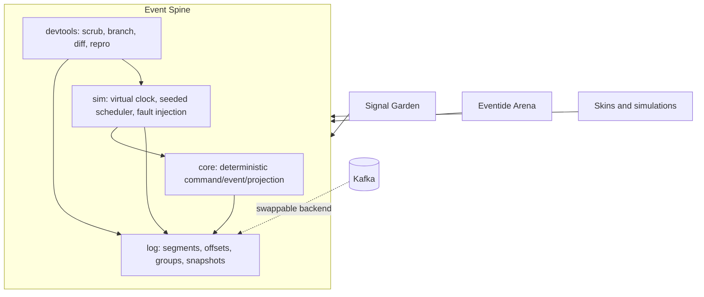

# Architecture

Four components in dependency order, with one hard rule running through all of
them: nothing observable may depend on wall time, goroutine scheduling, or
unseeded randomness.



The dotted edge is the point of the whole design: Kafka is a backend the `Log`
interface can adopt at M5, not a foundation the projects sit on. That inversion is
what makes partitioning, offsets, consumer groups, and backpressure things this
repository understands rather than things it configures.

> Diagrams of the boundary, the cycle, and the hash chain are in
> [concepts.md](concepts.md).

## internal/core

The command → validate → event → projection cycle. No I/O.

- **Commands are proposals.** They may be rejected, and a rejected command must
  leave state untouched.
- **Events are facts.** They are never rejected and never mutated after append.
- **A projection is a pure fold** over an event sequence. Same events, same
  projection, same hash — regardless of batching, restarts, or replay.

This is the package that can be tested exhaustively, because it has no
dependencies to stub. It is also the package where a determinism leak is most
expensive, since everything downstream inherits it.

## internal/log

The segmented append-only log. Full design in [log-design.md](log-design.md).

Responsibilities: record framing and CRC, segment rollover and sparse indexing,
offset assignment, consumer-group commits, snapshots, compaction, crash recovery,
and three selectable durability modes.

The interface is deliberately narrow so Kafka can sit behind it without distorting
either side:

```go
type Log interface {
    Append(ctx context.Context, records []Record) ([]Offset, error)
    Reader(ctx context.Context, from Offset) (Reader, error)
    Group(ctx context.Context, name string) (Group, error)
    Snapshot(ctx context.Context, offset Offset, state []byte) error
    Close() error
}
```

Anything Kafka can do that this interface cannot express is a capability no
consumer should depend on until one genuinely needs it.

## internal/sim

The virtual-clock, seeded, single-threaded scheduler. Full design in
[simulation-testing.md](simulation-testing.md).

Nothing runs concurrently; everything is *interleaved*, and the interleaving is
chosen by the seed. Time is advanced, never waited on, so a simulated hour costs
microseconds. Faults are injected on a seeded schedule, invariants are asserted
after every step, and failures are minimized before being committed to `seeds/`.

This package is exempt from the injected-dependency rule, since it is the thing
supplying the injections.

## internal/devtools

The debugger: scrub a log forward and backward, branch it at an offset to run an
alternate future, diff two projections to find the first divergent event, and step
a failing seed.

In the ideas backlog this was a separate project called Replay Arcade. It is far
more valuable attached to real systems than standing alone, which is why it lives
here.

## Boundaries

| Package | May import | Exempt from the determinism rule |
| --- | --- | --- |
| `internal/core` | nothing outside stdlib collections | no |
| `internal/log` | `internal/core`, injected `FS` | no |
| `internal/sim` | all internal packages | yes — it supplies the injections |
| `internal/devtools` | all internal packages | yes — it is tooling, not a runtime path |
| `internal/runtime` | stdlib freely | yes — it implements the real adapters |
| `cmd/spine` | all internal packages | yes — it wires concrete implementations |

`internal/runtime` is where `time.Now`, `math/rand`, `os`, and `net` are allowed
to appear, wrapped behind the `Clock`, `Source`, `IDGen`, `FS`, and `Transport`
interfaces. Everything else receives them.

Everything is `internal/` until three projects consume the spine. Nothing here has
earned a stable public API, and `internal/` makes that honest at the compiler
level instead of in a comment.

## Injected Dependencies

```go
type Deps struct {
    Clock Clock      // virtual time in simulation, wall time in production
    Rand  Source     // seeded in both; the seed is the reproduction key
    IDs   IDGen      // deterministic sequences, not UUIDv4
    FS    FS         // fault-injectable disk
    Net   Transport  // delay, loss, reorder, duplicate, partition
}
```

`scripts/check-determinism.sh` enforces the import half of this in CI. It cannot
catch map iteration order, `select` over multiple ready channels, or float
comparison in a projection — those are reviewed by hand, and they are the three
that have historically caused this class of bug.

## Data Flow, Normal Path

1. A consumer submits a command to `core`.
2. `core` validates it against the current projection and either rejects it or
   produces one or more events.
3. Events are appended to `log`, which assigns offsets and returns once the
   configured durability mode is satisfied.
4. Consumer groups read from their committed offset and fold events into
   projections.
5. A group commits its offset only when its projection is durable. That ordering
   is the difference between at-least-once and at-most-once, and it should be
   demonstrable on purpose.

The delivery contract is **at-least-once with idempotent projections**. Duplicates
are expected and die in the fold. Exactly-once is not offered, and no consumer
should be built assuming it.

## Recovery Path

On open, the log scans forward from its last index entry, validating framing and
CRC, stops at the first record that fails, and truncates to the end of the last
valid record. It reports the recovered offset and the bytes discarded.

A torn final record is the normal outcome of a crash mid-append and truncating it
is correct. Truncating a *valid* record is silent data loss, which is why recovery
reports what it discarded and the simulation asserts that the discarded bytes
never exceed the in-flight write.
