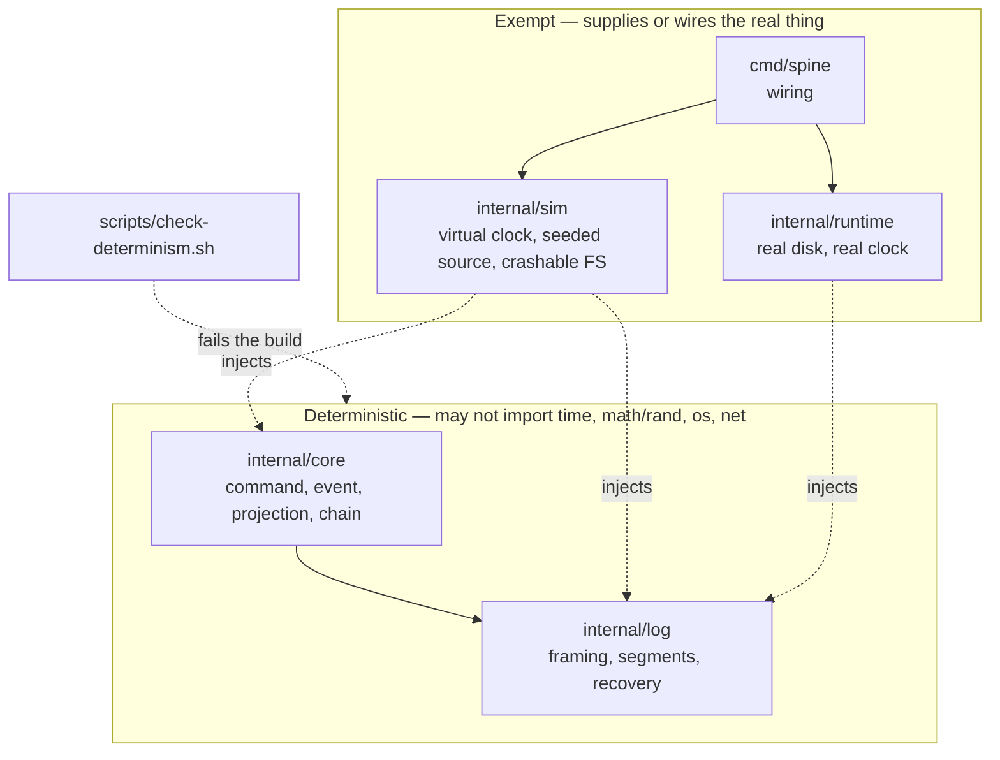
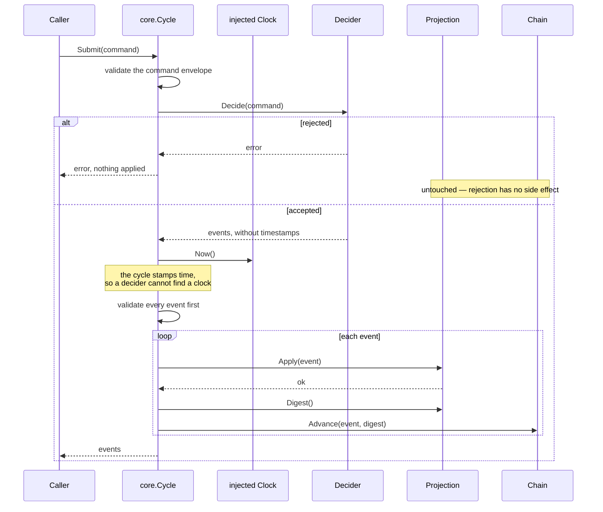
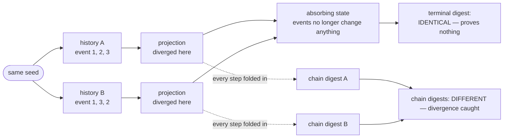
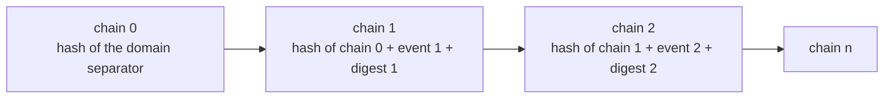
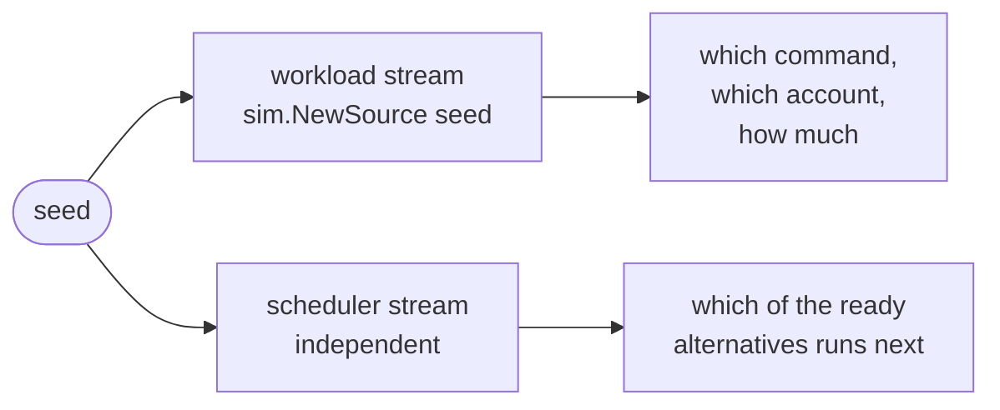
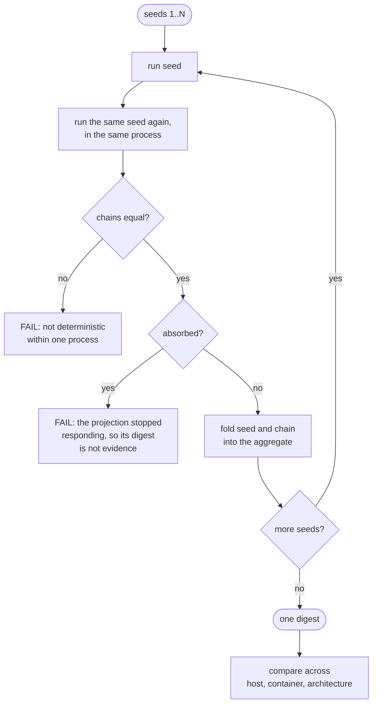
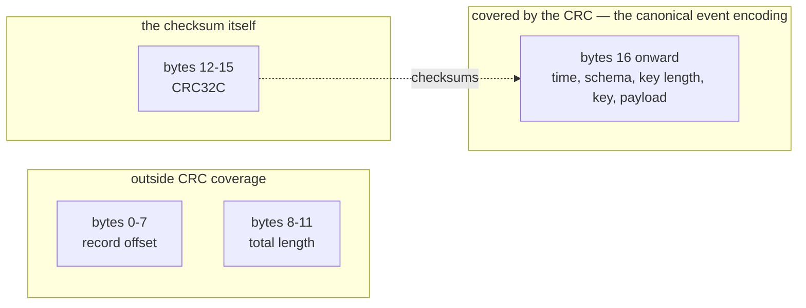
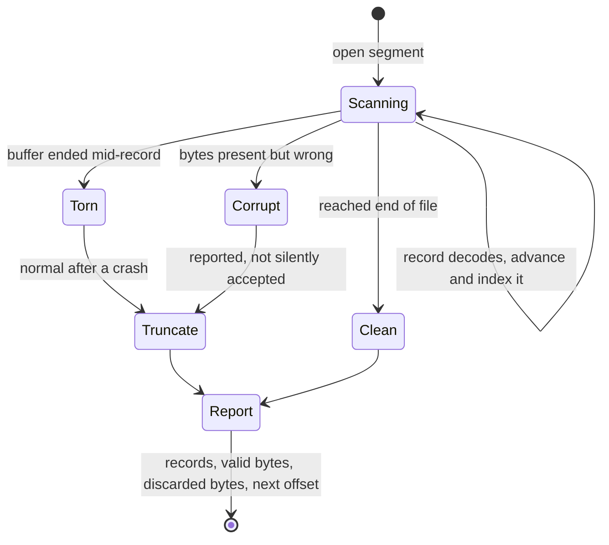
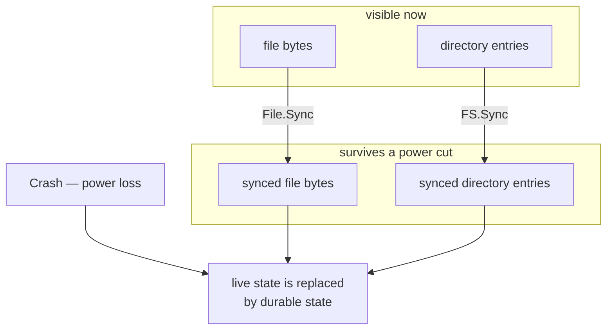
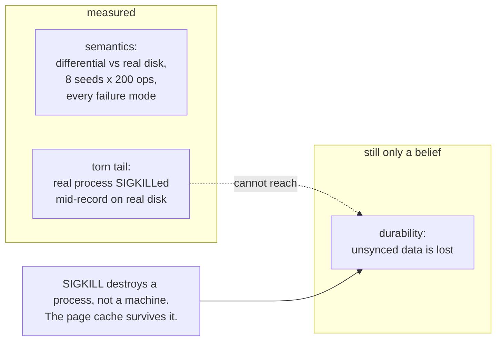

# Concepts, Illustrated

The properties this repository exists to protect are easy to state and easy to
break. This document draws the ones that are already implemented and tested, so
the shape of each is visible before the code is read.

Every diagram here describes code that exists. Nothing below is a plan.

- [The determinism boundary](#the-determinism-boundary)
- [The cycle](#the-cycle)
- [Why the chain, and not the final hash](#why-the-chain-and-not-the-final-hash)
- [The leak that added a sixth dependency](#the-leak-that-added-a-sixth-dependency)
- [The determinism gate](#the-determinism-gate)
- [Record framing and what the checksum covers](#record-framing-and-what-the-checksum-covers)
- [Recovery](#recovery)
- [The filesystem model, and where it stops being measured](#the-filesystem-model-and-where-it-stops-being-measured)

## The Determinism Boundary

Three packages may touch the real machine. Everything else receives what it
needs, which is what makes a run a function of its seed.



`check-determinism.sh` enforces the import half mechanically. It cannot see map
iteration order, a `select` over two ready channels, or a float comparison in a
projection — the three that have historically caused this class of bug. Two of
those three now have their own mechanical backstop, described below.

## The Cycle

`core.Cycle` runs command to event to projection. The diagram is worth drawing
because three of its edges are properties rather than steps.



Three things the picture is making explicit:

- **A rejected command leaves no trace.** Nothing is applied unless every event
  the decider returned validates first, so rejection is free of side effects by
  construction rather than by care.
- **Deciders do not stamp time.** The cycle overwrites whatever a decider put in
  `Event.Time` with a read from the injected clock. A decider that wanted a
  timestamp of its own would have to find a clock, and there is none to find.
- **A failed `Apply` poisons the cycle.** A projection that fails partway through
  a batch is holding some of a command's events and not others, which is a state
  no sequence of events describes. The cycle refuses all further work rather than
  continuing from it.

## Why The Chain, And Not The Final Hash

This is the finding that paid for the M0 spike. Comparing terminal projection
hashes is the obvious way to check determinism, and it is quietly unsound.

A projection that reaches an **absorbing state** — every organism dead, every
account drained, any state that stops responding to events — folds every history
to the same place. Two runs that genuinely diverged then agree.



Measured on Signal Garden: 40 runs of one identical live scenario produced **7
distinct final hashes** while the garden was still alive, and **1 hash across all
40** once the run was long enough to kill every organism — with the control
change still landing on 12 different ticks. The longer, more thorough-looking
test was the one that proved nothing.

`core.Chain` folds the event *and* the resulting projection digest at every step:



Both halves are needed. The event alone would miss a projection that applies an
event wrongly; the digest alone would miss two different events that happen to
land on the same state, which is the absorbing case again.

`Chain` also tracks how long the projection has sat still, and
`verify determinism` **fails an absorbed run instead of passing it** — agreement
between two absorbed runs is evidence about the absorbing state, not about
determinism.

## The Leak That Added A Sixth Dependency

`docs/architecture.md` planned five injected dependencies: `Clock`, `Source`,
`IDGen`, `FS`, `Transport`. The M0 spike found a leak that none of them covers.

```mermaid
sequenceDiagram
    participant Ticker
    participant Loop as run loop
    participant Client

    Note over Loop: select over a ready tick<br/>and a ready command

    Ticker-)Loop: tick ready
    Client-)Loop: SetControls ready

    alt Go picks the tick
        Loop->>Loop: advance to tick N+1
        Loop->>Loop: control applies at N+1
    else Go picks the command
        Loop->>Loop: control applies at N
        Loop->>Loop: advance to tick N+1
    end

    Note over Loop: same inputs, different tick,<br/>different projection, different hash
```

The choice between two simultaneously ready events is **neither time, nor
randomness, nor I/O**. It is now `core.Scheduler`, and `sim.Scheduler` takes it
from a seeded stream:



The streams are separate on purpose. Sharing one would mean that changing how
many events a command emits silently reshuffles every later interleaving — and
every minimized seed in `seeds/` would stop reproducing its failure the moment
the domain changed.

## The Determinism Gate

`task verify:determinism` is the M1 exit criterion. Two of its checks are not
obvious from the claim it tests.



The in-process repeat is not redundant with running the binary twice: Go
randomizes map iteration **per range statement**, so a projection can disagree
with itself without ever leaving the process. That is the cheapest possible place
to catch the one violation the import checker cannot see.

Measured: 1,000 seeds, 534,626 events, one digest on darwin/arm64, linux/arm64
and linux/amd64. The gate was then checked for teeth by making the ledger's
digest range a map, which it rejected immediately.

## Record Framing And What The Checksum Covers

The record layout is in [log-design.md](log-design.md). What matters here is
which regions are protected by what.



Neither exclusion is an oversight:

- **The length is outside because it has to be trusted first.** The CRC cannot be
  located until the record's extent is known. A corrupt length is caught by the
  record failing to parse at its boundary, or by bounds checks against the header
  size and the segment size.
- **The offset is outside because it is redundant.** A reader always knows which
  offset should come next, so a flipped offset is detectable — but only if
  somebody compares. That is why `DecodeAt` takes the expected offset and is the
  API callers should reach for, and `Decode` is the exception for tools
  inspecting an unknown file.

`TestEverySingleBitFlipIsDetected` flips every bit of every byte and asserts
which mechanism catches each one. It pins the count of CRC-invisible bits at
**64** — the offset field's — so widening coverage later shows up as a failing
number rather than as silence.

Bytes 16 onward are *exactly* `core.Event.AppendCanonical`'s output. One
encoding, so a projection digest taken in memory and one taken after a replay
cannot disagree — a bug that would otherwise appear only after a restart.

## Recovery

A crash mid-append leaves a partial record. Truncating it is correct. Truncating
a *valid* record is silent data loss, so recovery reports what it discarded.



Two decisions the diagram encodes:

- **Torn and corrupt are different outcomes.** A torn tail is the expected result
  of a crash during an append. A failed checksum is not, so recovery surfaces it
  and lets the caller choose between carrying on and stopping — only the caller
  knows whether this disk deserves trust.
- **A failed append seals the segment.** If a write fails partway, the file may
  hold a partial record; writing a valid record after it would make the tear
  unfindable. The segment refuses further appends instead.

## The Filesystem Model, And Where It Stops Being Measured

`sim.FS` models three things a map of names to bytes does not.



The consequence worth internalising: **a file whose bytes were synced into a
directory that was not synced does not survive at all.** That is what makes
crash-during-compaction the hazard it is — the new segment is written and
`fsync`ed, the rename is not made durable, and the file is simply gone.

What has been measured, and what has not:



A killed process loses nothing a power cut would, so no test here has yet
observed unsynced data disappearing. The rules above are the author's reading of
how filesystems behave, not a measurement.
[m2-filesystem-model.md](decisions/m2-filesystem-model.md) sets the trigger
explicitly: the first published durability claim needs a fault-injecting block
device behind it, or it is a claim about a belief.

## Where These Came From

| Concept | Recorded in |
| --- | --- |
| Chain over terminal hash, absorbing states, the scheduler leak | [m0-determinism-spike.md](decisions/m0-determinism-spike.md) |
| The determinism gate and its result | [m1-deterministic-core.md](decisions/m1-deterministic-core.md) |
| What the filesystem model proves and does not | [m2-filesystem-model.md](decisions/m2-filesystem-model.md) |
| The log's measured throughput, and the crash matrix's findings | [m2-owned-log.md](decisions/m2-owned-log.md) |
| Record layout, segments, recovery, durability modes | [log-design.md](log-design.md) |
